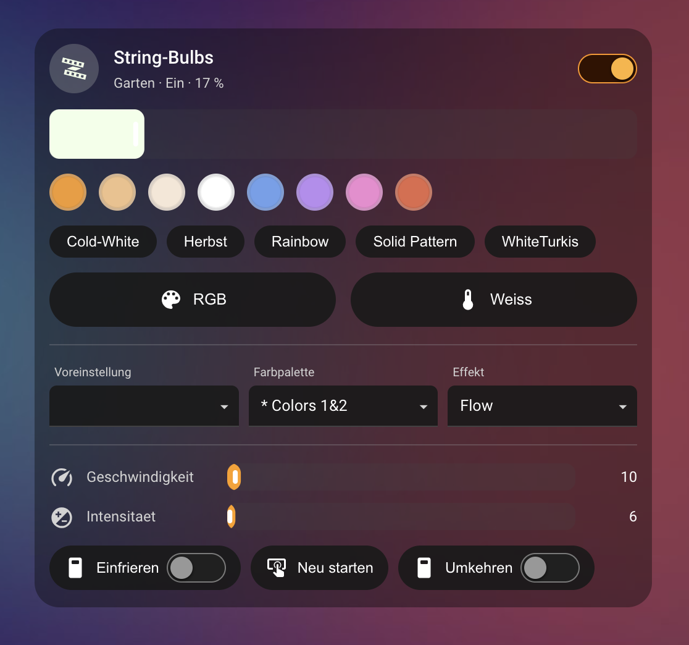
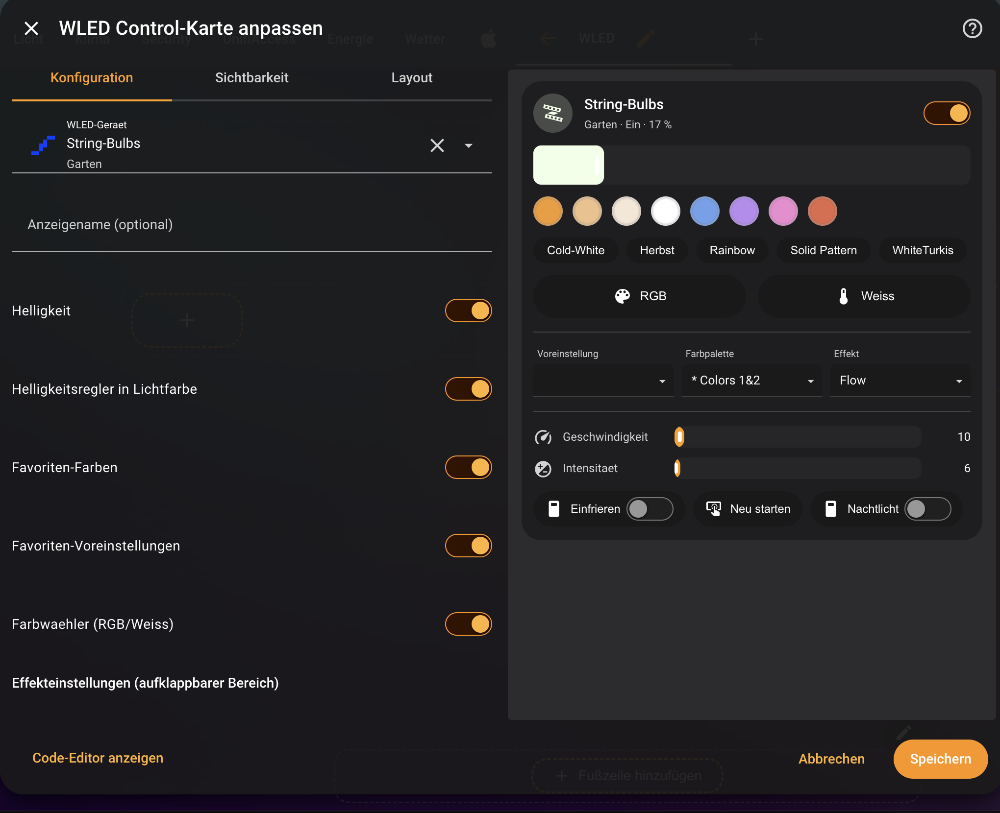
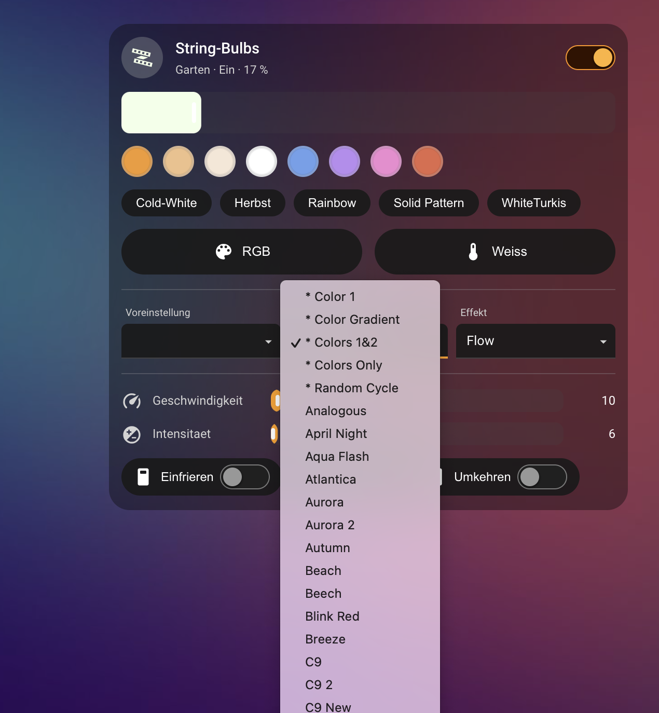
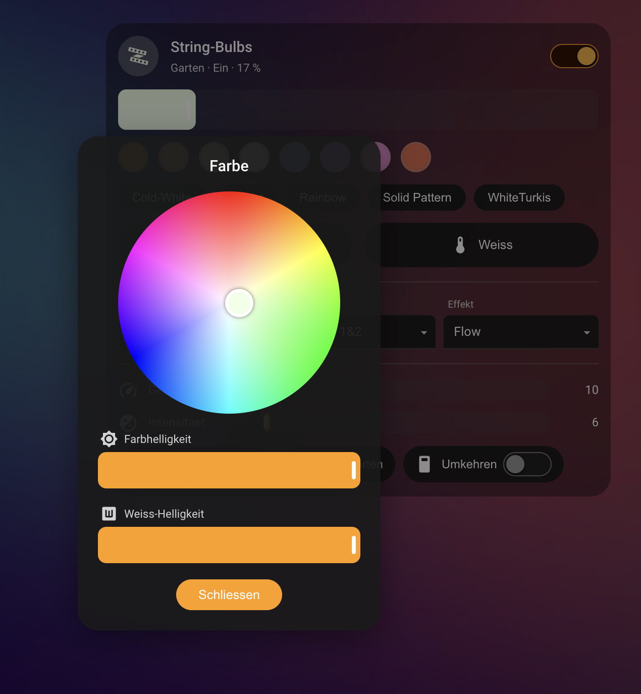
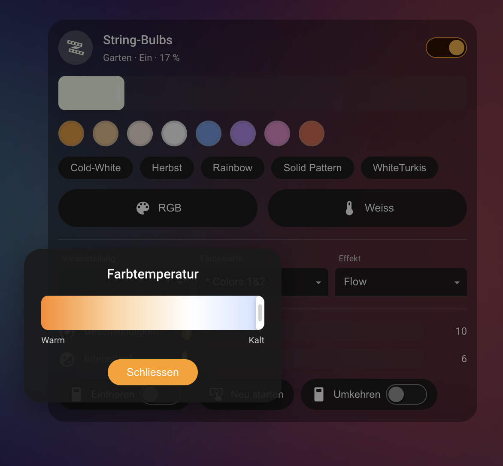

# WLED Control Card

Eine kompakte, vollständig grafisch konfigurierbare **Home-Assistant-Lovelace-Karte**
zur Steuerung eines WLED-Geräts. Optisch an den nativen HA-Licht-Dialog angelehnt,
aber flexibler: Helligkeit, Favoriten-Farben, RGB-/Weiß-Farbwähler, Presets,
Farbpaletten, Effekte, Geschwindigkeit/Intensität und frei wählbare Zusatz-Schalter/Buttons.



## Screenshots

Grafischer Editor – vollständig ohne YAML konfigurierbar:



Native Dropdowns (Voreinstellung · Farbpalette · Effekt):



<table>
  <tr>
    <td align="center"><b>RGB-Farbwähler</b><br/></td>
    <td align="center"><b>Weiß / Farbtemperatur</b><br/></td>
  </tr>
</table>

---

## Architektur auf einen Blick

Diese Card wird als **kleine, eingebettete Integration** ausgeliefert
(`custom_components/wled_control_card/`). Die Integration hat kein Geräte-Backend –
ihr einziger Zweck ist es, die mitgelieferte Karten-Datei
(`dist/wled-control-card.js`) auszuliefern und sich im Storage-Modus **automatisch als
Dashboard-Ressource** zu registrieren. Dadurch liegt die Karte dort, wo auch andere
integrationsgebündelte Karten liegen, und es ist **kein manuelles Eintragen einer
Ressource** nötig.

Die Karte selbst ist **buildfrei**: eine einzige Vanilla-JavaScript-Datei, ganz ohne
npm, Bundler oder externe Abhängigkeiten (offline-tauglich). Sie basiert auf dem
offiziell dokumentierten Custom-Card-Vertrag (`HTMLElement`) und verwendet durchgängig
**native HA-Komponenten** (`ha-control-slider`, `ha-select`, `ha-switch`, `ha-form`,
`ha-hs-color-picker`, `ha-color-temp-picker` …). Theming, Barrierefreiheit sowie
Dark-/Light-Unterstützung kommen dadurch „gratis".

---

## Installation

### Variante A – HACS (empfohlen)

1. HACS → oben rechts das Menü → **Benutzerdefinierte Repositories**.
2. URL dieses Repos eintragen, Kategorie **Integration** wählen, hinzufügen.
3. „WLED Control Card" in HACS installieren.
4. Home Assistant **neu starten**.
5. **Einstellungen → Geräte & Dienste → Integration hinzufügen → „WLED Control Card"**
   und den Dialog mit *Absenden* bestätigen. Damit wird die Karte automatisch als
   Dashboard-Ressource registriert.

### Variante B – Manuell

1. Ordner `custom_components/wled_control_card/` in dein HA-Config-Verzeichnis unter
   `custom_components/` kopieren.
2. Home Assistant **neu starten**.
3. **Einstellungen → Geräte & Dienste → Integration hinzufügen → „WLED Control Card"**
   → *Absenden*.

> Die Karte wird über `add_extra_js_url` als Frontend-Modul geladen und funktioniert
> dadurch **sowohl im Storage- als auch im YAML-Modus** von Lovelace – ein manueller
> Ressourceneintrag ist nicht nötig.

Nach der Einrichtung erscheint die Karte im Dashboard-Karteneditor unter
**„WLED Control Card"** (mit Vorschau). Nach dem Neustart ggf. einmal den Browser
hart neu laden (Strg/Cmd + Shift + R).

---

## Verwendung

1. Dashboard bearbeiten → **Karte hinzufügen** → **WLED Control Card**.
2. Im **grafischen Editor** das WLED-Gerät auswählen. Die passenden Steuerelemente
   werden automatisch erkannt.
3. Sektionen ein-/ausschalten und die gewünschten Zusatz-Schalter/Buttons anhaken.

Kein YAML nötig – aber möglich (siehe unten).

---

## Konfigurations-Optionen

| Option | Typ | Default | Beschreibung |
|---|---|---|---|
| `device` | string | – | **Pflicht.** Die Device-ID des WLED-Geräts. |
| `name` | string | Gerätename | Optionaler Anzeigename in der Kopfzeile. |
| `show_brightness` | bool | `true` | Helligkeitsregler anzeigen. |
| `show_favorites` | bool | `true` | Favoriten-Farbfelder anzeigen. |
| `show_color_pickers` | bool | `true` | RGB-/Weiß-Farbwähler-Buttons anzeigen. |
| `show_presets` | bool | `true` | Dropdown „Voreinstellung". |
| `show_palettes` | bool | `true` | Dropdown „Farbpalette". |
| `show_playlist` | bool | `false` | Optionales Dropdown „Wiedergabeliste". |
| `show_effects` | bool | `true` | Dropdown „Effekt". |
| `show_speed` | bool | `true` | Slider „Geschwindigkeit". |
| `show_intensity` | bool | `true` | Slider „Intensität". |
| `collapsible_dropdowns` | bool | `false` | Dropdown-Bereich einklappen; nur ein Pfeil, der die Karte bei Klick aufklappt. |
| `dynamic_brightness_color` | bool | `true` | Helligkeitsregler nimmt die aktuelle Lichtfarbe an (`false` = Standard-Akzentfarbe). |
| `favorite_colors` | Liste von `[r,g,b]` | 8 Standardfarben | Eigene Favoriten-Farben. |
| `favorite_presets` | Liste von Preset-Namen | `[]` | Voreinstellungen, die als Schnellwahl-Buttons unter den Favoritenfarben erscheinen. |
| `extra_controls` | Liste von `entity_id` | `[]` | Zusatz-`switch`/`button` (o. `select`/`number`), die unten als Reihe erscheinen. |
| `light_entity` | string | auto | Override der Light-Entität (z. B. bei mehreren Segmenten). |
| `preset_entity` | string | auto | Override der Preset-`select`-Entität. |
| `palette_entity` | string | auto | Override der Paletten-`select`-Entität. |
| `playlist_entity` | string | auto | Override der Playlist-`select`-Entität. |
| `speed_entity` | string | auto | Override der Speed-`number`-Entität. |
| `intensity_entity` | string | auto | Override der Intensitäts-`number`-Entität. |

### YAML-Beispiel

```yaml
type: custom:wled-control-card
device: abcdef1234567890            # Device-ID des WLED-Geräts
name: String-Bulbs
show_brightness: true
show_favorites: true
favorite_colors:
  - [243, 154, 46]
  - [240, 192, 138]
  - [246, 231, 214]
  - [255, 255, 255]
  - [110, 160, 236]
  - [185, 140, 240]
  - [240, 138, 208]
  - [226, 105, 74]
show_color_pickers: true
show_presets: true
show_palettes: true
show_playlist: false
show_effects: true
show_speed: true
show_intensity: true
extra_controls:
  - switch.string_bulbs_empfang_synchronisieren
  - switch.string_bulbs_einfrieren
  - button.string_bulbs_neu_starten
```

Die Entity-IDs sind Beispiele – sie werden normalerweise **automatisch aus dem Gerät
abgeleitet** und müssen nicht angegeben werden.

---

## Automatische Entitäts-Erkennung

Aus der gewählten `device`-ID leitet die Karte alle Rollen ab. Priorisiert werden
stabile Merkmale (`translation_key`, Domain), danach folgt eine Namensheuristik:

| Rolle | Domain | Erkennung |
|---|---|---|
| Hauptlicht | `light` | erste Light-Entität des Geräts (bei Segmenten per Override wählbar) |
| Voreinstellung | `select` | `translation_key: preset` |
| Farbpalette | `select` | `translation_key: color_palette` |
| Wiedergabeliste | `select` | `translation_key: playlist` |
| Geschwindigkeit | `number` | `translation_key: speed` |
| Intensität | `number` | `translation_key: intensity` |
| Effekt | Attribut `effect_list` des Lichts | – |

Fehlt eine Rolle, wird die entsprechende Sektion **ausgeblendet** (kein Fehler).

---

## Farbwähler

Die RGB-/Weiß-Buttons öffnen ein leichtgewichtiges Popup:

- **RGB:** ein **eigenes HS-Farbrad**, das optisch dem nativen HA-Rad entspricht, plus –
  je nach Farbschema des Lichts – die Slider **Farbhelligkeit** und **Weiß-Helligkeit**
  (bzw. **Kaltweiß/Warmweiß** bei RGBWW). Eigenimplementierung statt `ha-hs-color-picker`,
  da dieses nur lazy im Licht-Dialog geladen wird; das eigene Rad lädt **sofort und offline**.
- **Weiß/Farbtemperatur:** ein `ha-control-slider` im **Kelvin**-Bereich des Lichts
  (Modus „cursor" mit Warm→Kalt-Verlauf).

Service-Aufrufe (wie im nativen Licht-Dialog):
- RGB-Licht → `light.turn_on` mit `rgb_color`
- RGBW → `rgbw_color: [r,g,b,w]` (Weiß-Kanal wird erhalten)
- RGBWW → `rgbww_color: [r,g,b,cw,ww]` (Kalt-/Warmweiß werden erhalten)
- Reines HS-Licht → `hs_color`
- Weiß-Button → `color_temp_kelvin`

Die Buttons erscheinen nur, wenn das Licht das jeweilige Farbschema unterstützt.

---

## Robustheit

- **Mehrere Light-Entitäten** (Segmente/Master): Hauptlicht per `light_entity` wählbar,
  Default = erste Entität.
- **Nicht verfügbare Entitäten**: Elemente bleiben sichtbar, sind aber deaktiviert
  (kein Crash).
- **Fehlende Rollen**: Sektion wird ausgeblendet.
- **Kein Gerät gesetzt**: freundlicher Hinweis in der Karte.
- Slider sind **entprellt** (~200 ms) und arbeiten **optimistisch**; ein laufender
  Drag-Vorgang wird durch `hass`-Updates nicht unterbrochen.
- `min`/`max`/`step` der `number`-Entitäten werden übernommen (nicht 0–255 angenommen).

---

## Kein Build-Schritt

Kein npm, kein TypeScript-Compile, kein Bundler und keine CDN-Abhängigkeit zur Laufzeit.
`dist/wled-control-card.js` ist direkt die ausgelieferte Datei. Wer etwas ändern will,
editiert einfach diese eine Datei.

---

## Lizenz

MIT
